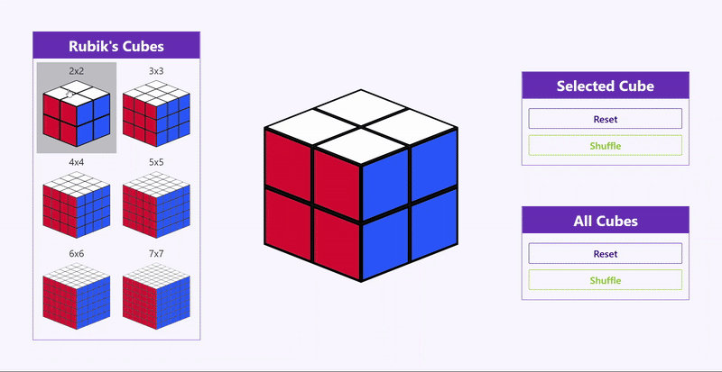
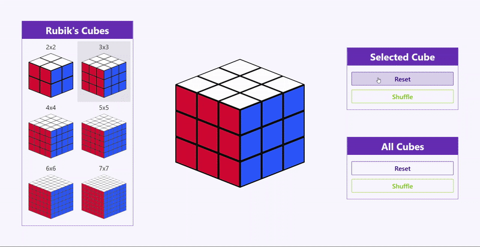
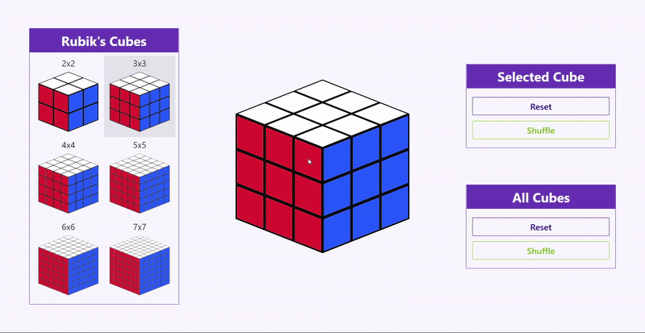

# Rubik's Cube Simulator
A desktop WPF application that allows users to move and solve Rubik’s Cubes of various sizes.
The simulator provides the ability to move the cube, select its size, randomly shuffle, and reset the puzzle to solved state.

## Cube Management
### Choosing the Cube
Just click the cube of the desired size on the left side of the screen to select it.

### Shuffling and Resetting the Cube
Use the buttons on the right side of the screen to randomly shuffle or reset the selected or all cubes to their initial state.

### Moving the Cube
Move the cube, point the cursor at the cube and use the 'W', 'A', 'S', 'D' and 'Shift' keys.

## Installation
* Download the `RubiksCubeSimulator.zip` archive from the [release page](https://github.com/stlss/rubiks-cube-simulator/releases/tag/v1.0)
* Extract the zip-archive - it contains `.cmd` file a folder with the compiled application binaries
* Run `CreateShortсut.cmd` to create a desktop shortcut
* Launch **Rubik's Cube Simulator** using the created shortcut

### Requirements
* Windows 10 or later (64-bit)